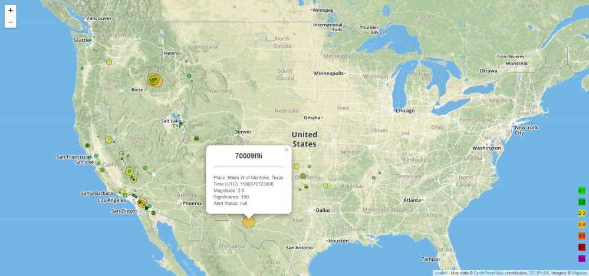

<!-- header -->

    

    <!-- Header -->
        
        <h2>epicentered</h2>
        
<i>cool-epicentered-tagline</i>

    

    

    <!-- Shields -->
        
        
        
        
        
    

    

    <!-- Links -->
        <a href="https://armckinney.github.io/epicentered/">View Demo</a>
        ·
        <a href="https://github.com/armckinney/epicentered/issues/new/choose">Report Bug</a>
        ·
        <a href="https://github.com/armckinney/epicentered/issues/new/choose">Request Feature</a>
    

 
 

    

Epicentered is a web page detailing a large quantity of earthquake epicenters and their associated details.

The data used in Epicentered is pulled from an API, meaning that your views stay up-to-date and real-time.

Here's why Epicentered is important:
* Helping geologists determine key points of interest & activity
* Helping home owners figure out where they might NOT want to live
